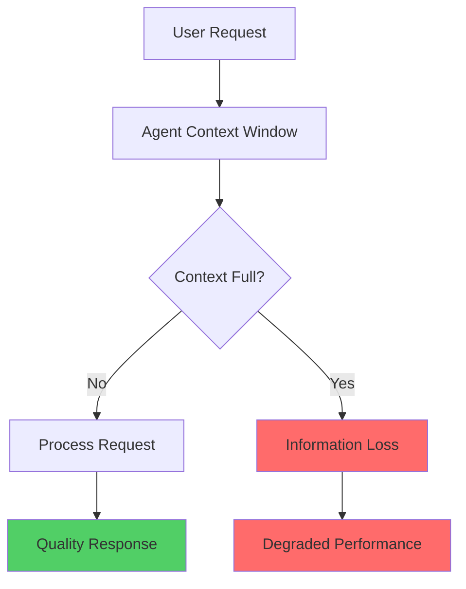
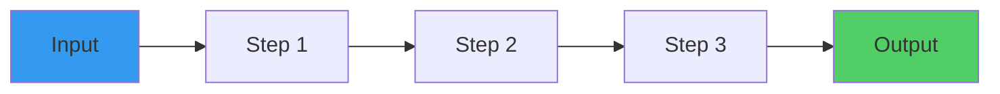
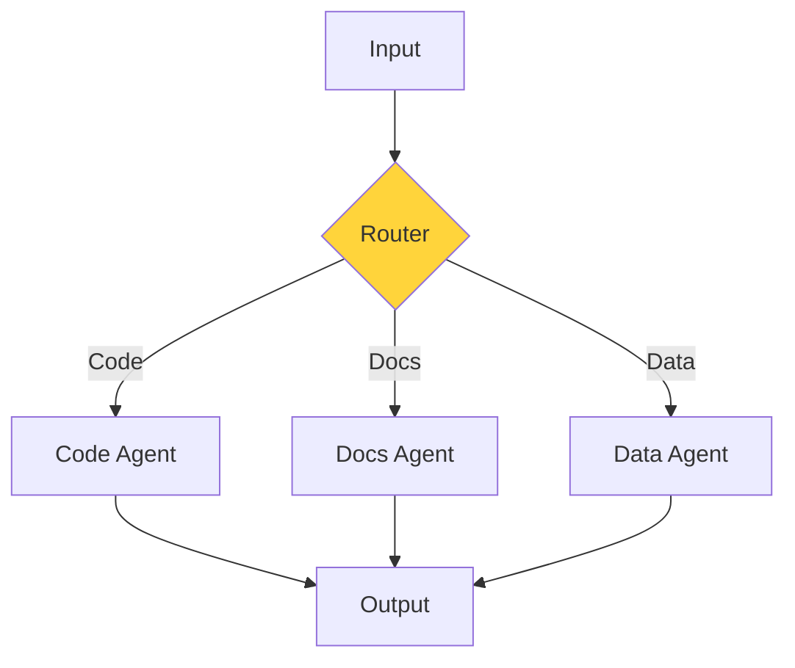
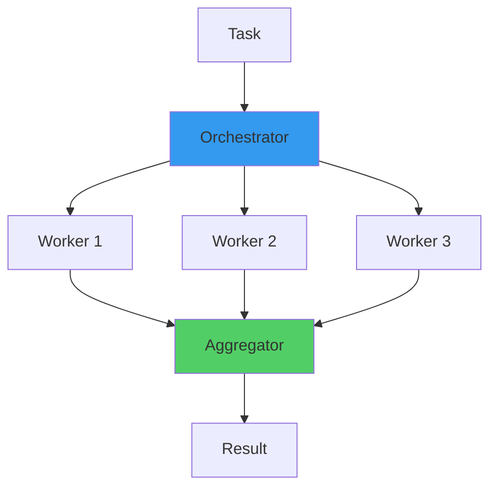
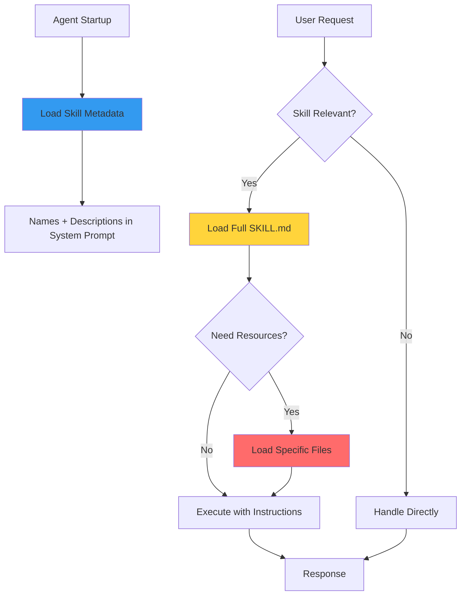
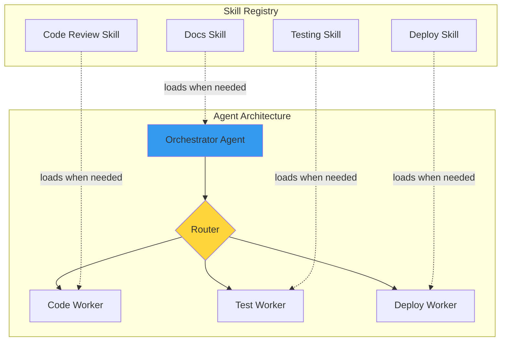
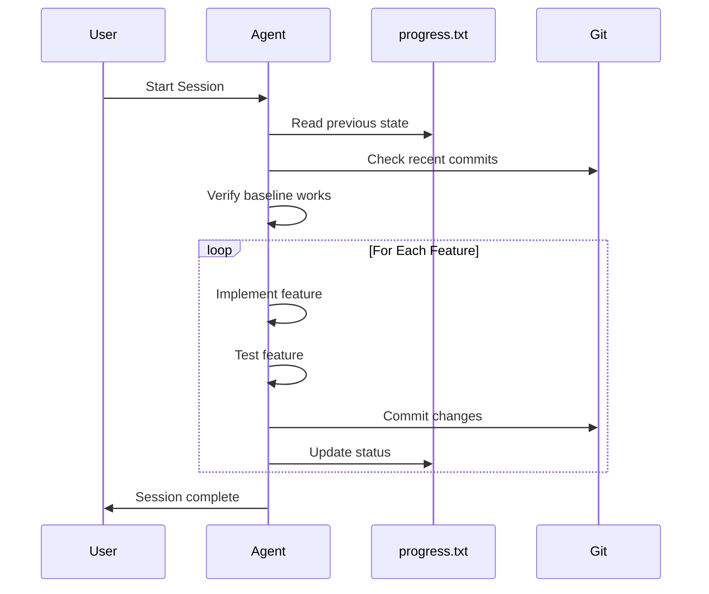

As AI agents become increasingly capable, we face a fundamental challenge: **how do we scale their expertise without hitting the limits of context windows?**

This post explores the architectural patterns emerging from Anthropic's research and the open standards being built to solve this problem.

## The Context Window Problem

Every AI agent operates within a finite context window—a limited "attention budget" that constrains how much information it can process at once. Research on context degradation shows that as token volume increases, model recall accuracy decreases.



This creates a fundamental tension: agents need vast knowledge to be useful, but loading everything into context makes them less effective.

## Anthropic's Six Composable Patterns

Rather than building monolithic agents, [Anthropic's research on building effective agents](https://www.anthropic.com/research/building-effective-agents) identifies six composable patterns that scale elegantly:

### 1. Prompt Chaining

Decompose tasks into sequential steps, where each LLM call processes the output of the previous one.



### 2. Routing

Classify inputs and direct them to specialized handlers. This is particularly powerful when distinct categories benefit from separate optimization.



### 3. Parallelization

Run independent subtasks simultaneously—either by sectioning work across parallel agents or by voting (running the same task multiple times for diverse outputs).



### 4. Orchestrator-Workers

A central LLM dynamically breaks down tasks, delegates to worker LLMs, and synthesizes results. This suits unpredictable subtask requirements.

### 5. Evaluator-Optimizer

One LLM generates responses while another provides iterative feedback—useful when clear evaluation criteria exist.

### 6. Autonomous Agents

LLMs dynamically direct their own processes and tool usage. Best for open-ended problems where the number of steps is unpredictable.

## The Skills Solution

These patterns show *how* to structure agent architectures. But they don't solve the knowledge scaling problem: how do we give agents specialized expertise without overloading their context?

Enter **Agent Skills**—an open standard [originally developed by Anthropic](https://www.anthropic.com/engineering/equipping-agents-for-the-real-world-with-agent-skills) and now adopted across the industry.

### What Are Skills?

A skill is simply a folder containing:

```
my-skill/
├── SKILL.md      # Instructions + metadata
├── scripts/      # Optional executable code
└── references/   # Optional documentation
```

The `SKILL.md` file contains YAML frontmatter with metadata and markdown instructions:

```yaml
---
name: code-reviewer
description: Reviews code for bugs, security issues, and best practices
---

# Code Reviewer

When reviewing code, follow these steps:
1. Check for security vulnerabilities
2. Identify potential bugs
3. Suggest performance improvements
...
```

### Progressive Disclosure Architecture

The genius of skills lies in **progressive disclosure**—loading information only when needed:



This three-level approach means:

1. **Level 1**: Only skill names and descriptions load at startup
2. **Level 2**: Full SKILL.md content loads when the agent determines relevance
3. **Level 3**: Additional resources load only as specific scenarios require

### Cross-Agent Interoperability

Skills work across multiple AI platforms:

| Agent | Skills Directory |
|-------|-----------------|
| Claude Code | `~/.claude/skills/` |
| Cursor | `.cursor/skills/` |
| GitHub Copilot | `.github/skills/` |
| VS Code | `.vscode/skills/` |
| Amp | `~/.amp/skills/` |

This means you can create a skill once and use it everywhere.

## The Scaling Architecture

Combining Anthropic's patterns with skills creates a powerful scaling architecture:



This architecture provides:

- **Unlimited expertise**: Skills can contain effectively unlimited context since agents access only what's needed
- **Specialization without redesign**: General-purpose agents become domain-specific agents by loading relevant skills
- **Determinism**: Bundled scripts provide reliable, repeatable execution for operations better suited to code than token generation

## Long-Running Agent Sessions

For agents that work across multiple sessions, [Anthropic's research on effective harnesses](https://www.anthropic.com/engineering/effective-harnesses-for-long-running-agents) introduces additional patterns:



Key mechanisms for state persistence:

1. **Progress files**: Track completed work across sessions
2. **Git history**: Provide clear record of changes
3. **Feature lists**: Maintain passing/failing status to prevent premature completion

## Getting Started

### Install Skills

Using [AI Agent Skills](https://github.com/skillcreatorai/Ai-Agent-Skills), the universal installer:

```bash
# Browse available skills
npx ai-agent-skills browse

# Install a skill
npx ai-agent-skills install code-reviewer

# Install from GitHub
npx ai-agent-skills install anthropics/skills/skill-creator
```

### Create Your Own Skills

1. Create a folder with a `SKILL.md` file
2. Add instructions in markdown
3. Optionally add scripts for deterministic operations
4. Install to your agent's skills directory

Or use [SkillCreator.ai](https://www.skillcreator.ai/) to generate skills from natural language descriptions.

## Conclusion

Scaling AI agents isn't about building bigger context windows—it's about building smarter architectures. The combination of:

- **Composable patterns** for agent structure
- **Progressive disclosure** for knowledge loading
- **Open standards** for interoperability

...creates a foundation for agents that can grow their expertise indefinitely while maintaining performance.

The future of AI agents is modular, portable, and skill-based.

---

## Sources

- [Building Effective Agents - Anthropic](https://www.anthropic.com/research/building-effective-agents)
- [Effective Harnesses for Long-Running Agents - Anthropic](https://www.anthropic.com/engineering/effective-harnesses-for-long-running-agents)
- [Equipping Agents with Skills - Anthropic](https://www.anthropic.com/engineering/equipping-agents-for-the-real-world-with-agent-skills)
- [Agent Skills Specification - agentskills.io](https://agentskills.io/home)
- [AI Agent Skills Installer - GitHub](https://github.com/skillcreatorai/Ai-Agent-Skills)
- [SkillCreator.ai](https://www.skillcreator.ai/)
